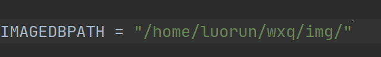

# 紫宸
软件杯-基于深度学习的智能遥感平台

## 项目介绍
### 系统简介
* 紫宸系统基于一站式AI开发平台AI Studio对上传遥感图片进行AI智能分析，旨在全面、可视化展示遥感影像在系统下的分析结果，实现一站式分析的目标
* 本系统将以项目为基础，图层作为操作单元，以遥感实际使用的场景为依据帮助用户清晰、方便的获得目标分析结果；同时系统将会根据项目自动帮助用户整合相同或相关场景下的已上传图片及对应的分析结果
* [紫宸 (danmoits.com)](http://zichen.danmoits.com/home)
### 核心功能
* **项目库**：以项目为基础，每一项目中可存储多个待分析图片；待分析图片在经过分析后将会在项目中自动生成组从属于项目层级
* **视角切换**：系统对于分析提供轴测和平面两种视角，适用于不同要求下的场景（全面或详细）
* **变化检测**：给定不同时间拍摄的相同位置（地理配准）的遥感图像，可定位出其中建筑变化的区域
* **地物分类**：对待分析遥感图像进行分析展示地块及其他对象在图像表达上的划分
* **目标提取**：对待分析遥感图像进行道路轮廓的提取并加以区分
* **目标检测**：对待分析遥感图像识别目标对象类型在图像中的位置
### 系统特色
**多视角分析展示**
* 轴测视角能够同时展示特定遥感图像分析地全部结果，保证用户能够对于图像获得更高维度的分析

、

* 平面视角能够准确观察到图像细节之间地对比和分析结果与图像的对应关系


**多层级管理**
* 系统通过项目、组、图层三个层级管理遥感图像及其分析结果，方便、快捷、高效
* 项目内可存储多个遥感图像及其对应的所有分析结果
* 组内存储单个遥感图像及其所有分析结果
### 操作流程

## 前端部署

- `npm i` 或 `cnpm i` 安装依赖
- `npm run build` 得到打包目录 dist，如果遇到报错信息，定位到报错的那一行代码，在它的上一行加上`/*@ts-ignore*/`，重新打包
- 购买一台服务器，通过 sftp 将打包得到的的 /dist 上传至服务器
- 购买域名，完成域名解析
- ssh 远程连接服务器，安装 nginx，完成 nginx.conf 的配置，最终执行`/usr/local/nginx/sbin/nginx -s reload`
- 访问域名，即可看到网站，部署成功

## 后端部署

- `git clone` 克隆项目到本地
- 设置 go mod 代理服务器
  - Windows 下运行命令 `go env -w GOPROXY=https://goproxy.cn,direct`
  - macOS 或 Linux 下运行命令 `export GOPROXY=https://goproxy.cn`
- 设置包管理模式为 go mod 模式
  - Windows 下运行命令 `set GO111MODULE=on 或者 set GO111MODULE=auto`
  - macOS 或 Linux 下运行命令 `export GO111MODULE=on 或者 set GO111MODULE=auto`
- `go mod tidy` 下载项目依赖
- 配置阿里云 OSS 对象服务、MySQL服务器、应用服务器（非必须，也可本地运行）
- 填写配置文件，因为项目较简单，直接使用 .go 文件作为配置文件，项目配置文件在 ./server/go/config 目录下
  - 在 file.go 文件中
    - *`AvatarPath`* ：阿里云 OSS 对象存储服务中头像存储根路径
    - *`ProjectPath`* ：阿里云 OSS 对象存储服务中项目图片存储根路径
    - *`LocalPicPath`* ：本地目录下图片存储路径（要求与 ./server/python 项目中配置本地路径相同）
  - 在 mysql.go 文件中
    - *`Username`* ：MySQL 用户用户名
    - *`Password`* ：MySQL 用户用户密码
    - *`Host`* ：MySQL 服务器 IP 地址
    - *`Port`* ：MySQL 服务运行端口号
    - *`Database`* ：MySQL 实例名称
    - *`Charset`* ：MySQL 实例字符集（推荐设置为 utf8mb4）
  - 在 oss.go 文件中
    - *`EndPoint`* ：阿里云 OSS 配置端点
    - *`AccessKey`* ：阿里云 OSS 身份认证 key
    - *`AccessSecret`* ：阿里云 OSS 配置秘钥
    - *`Bucket`* ：阿里云 OSS 配置存储桶
- 在 ./server/go/main.go 文件中可修改服务运行端口，默认为 8801
- 编译项目
  - 若目标平台与编译平台环境相同，则使用命令 `go build main.go`
  - 若目标平台与编译平台环境不同，则使用对应 go 语言交叉编译命令
- 将编译产生的可执行文件在目标平台上运行，运行成功后，访问对应 IP:port 即可

## 算法部署

需要GPU进行模型的训练和部署**显存>=6G**

https://pan.baidu.com/s/1-a0snuTHXLkhNTauLV2bNA

提取码：SCUP 

可以下载训练好的模型，也可以自己训练部署

```
conda create -n <your env name> python=3.7/8/9
conda activate <your env name>
pip install flask
pip install paddlepaddle
pip install paddlers
```

需保证paddle和paddlers的版本和你机器上的环境对的上

[paddlepaddle安装传送门](https://www.paddlepaddle.org.cn/install/quick?docurl=/documentation/docs/zh/develop/install/pip/linux-pip.html)

[源码安装PaddleRS](https://github.com/PaddleCV-SIG/PaddleRS)

确定环境依赖安装完毕可以开始训练模型

```shell
### 变化检测模型训练
python cd.py
### 目标提取模型训练
python oa.py
### 目标检测模型训练
python od.py
### 地物分割模型训练
python gs.py
```

通过paddlers.deploy.export模块导出训练好的模型参数

[模型部署教程](https://github.com/PaddleCV-SIG/PaddleRS/tree/develop/deploy)

将导出好的模型按目录结构放置好后

修改app.py中图片文件存储路径



python app.py启动flask即可完成算法模块的部署。
